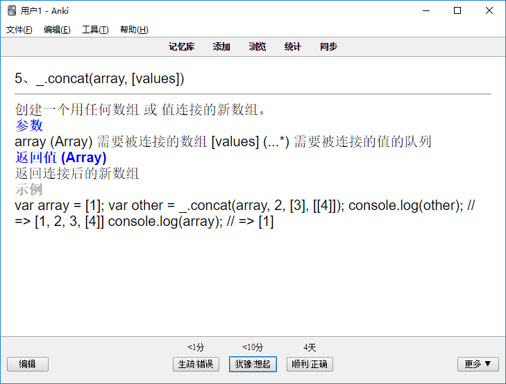

# Make Anki Card in nodejs
// 制作一些简单的anki卡片，用来记忆在学习过程中需要简单记忆（有印象）的知识

# Content
[1.Lodash](#目前示例)

---
<h2><b>食用方法</b></h2>
> 1、 yarn install   //安装所需模块
>
> 2、 运行所需卡片文件，如：
>
>
>```js
>     node lodashOfAnki.js
>```
> 3、 导入anki选择lodash.txt => 选择制表符('\t')分割字段
## 1.[Lodash][0]
> 一个 JavaScript 的实用工具库, 表现一致性, 模块化, 高性能, 以及 可扩展

[官网][1]

[0]: ./lodash/lodashOfAnki.js
[1]: https://www.lodashjs.com/

### 目前示例：
```json
1、_.chunk(array, [size=0])	"<div>将数组拆分成多个 size 长度的块，并组成一个新数组。如果数组无法被分割成全部等长的块，那么最后剩余的元素将组成一个块。</div><div><font color=""#0000ff""><b>参数</b></font></div><div>array (Array) 需要被处理的数组 [size=0] (number) 每个块的长度     </div><div><font color=""#0000ff""><b>返回值 (Array)</b></font></div><div>  返回一个拆分好的新数组</div><div><font color=""#a9a9a9""><b>示例</b></font></div><div>_.chunk(['a', 'b', 'c', 'd'], 2);
// => [['a', 'b'], ['c', 'd']]

_.chunk(['a', 'b', 'c', 'd'], 3);
// => [['a', 'b', 'c'], ['d']]

</div>"
3、_.compact(array)	"<div>创建一个移除了所有假值的数组。例如：false、null、0、""、undefined， 以及NaN 都是 “假值”.</div><div><font color=""#0000ff""><b>参数</b></font></div><div>array (Array) 需要被处理的数组。     </div><div><font color=""#0000ff""><b>返回值 (Array)</b></font></div><div>  返回移除了假值的数组。</div><div><font color=""#a9a9a9""><b>示例</b></font></div><div>_.compact([0, 1, false, 2, '', 3]);
// => [1, 2, 3]

</div>"

    .
    .
    .
    
586、创建一个包含从 start 到 end，但不包含 end 本身范围数字的数组。如果 start 是负数，而 end 或 step 没有指定，那么 step 从 -1 为开始。如果 end 没有指定，start 设置为 0。如果 end 小于 start，会创建一个空数组，除非指定了 step。注意: JavaScript 遵循 IEEE-754 标准处理无法预料的浮点数结果。	"_.range([start=0], end, [step=1])"
588、这个方法类似 _.range，除了它是降序生成值的。	"_.rangeRight([start=0], end, [step=1])"
590、创建一个给定上下文对象的原始的 lodash 函数。	"_.runInContext([context=root])"
592、调用 iteratee N 次，每次调用返回的结果存入到数组中。iteratee 会传入1个参数：(index)。	"_.times(n, [iteratee=_.identity])"
594、创建 value 为属性路径的数组	"_.toPath(value)"
596、创建唯一ID。如果提供了 prefix，会被添加到ID前缀上。	"_.uniqueId([prefix])"

```
### anki效果:


